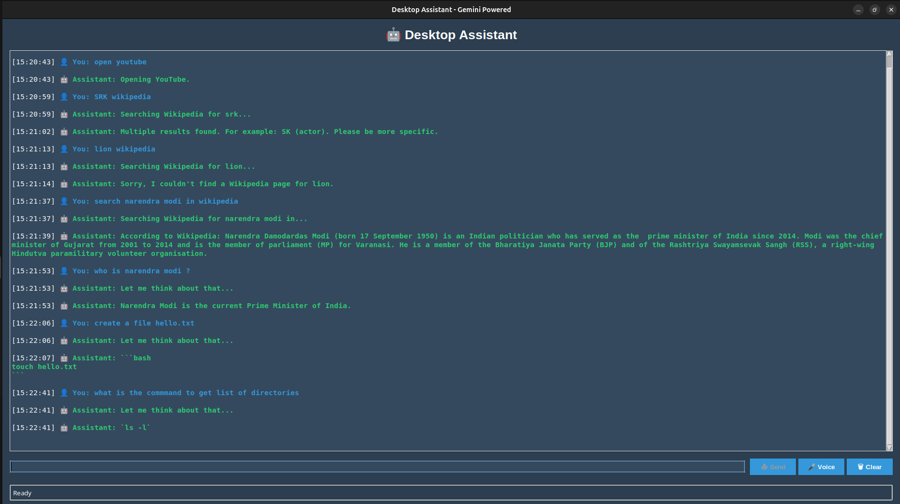

# DeskMate-AI: Your Personal Desktop Assistant


A versatile, voice-activated desktop assistant built with Python and containerized with Docker. This application provides a conversational interface to perform various tasks using Google's Gemini AI, all accessible through a clean Tkinter GUI or voice commands.



---

## ✨ Features

-   **🤖 Intelligent Conversations:** Powered by Google's `gemini-2.0-flash-exp` model for smart, context-aware interactions.
-   **🗣️ Dual Input:** Interact via a clean Tkinter GUI or go hands-free with voice commands.
-   **🌐 Web & Info Access:** Instantly search Wikipedia, Google, or YouTube.
-   **📂 File System Operations:** Create folders and text files on your desktop with simple commands.
-   **📸 Media Capture:** Capture photos and record short video clips using your webcam.
-   **🐳 Dockerized:** Runs in a consistent and isolated Docker container, eliminating dependency hell.
-   **📝 Persistent Output:** All created files (logs, photos, videos) are saved directly to your host machine for easy access.

---

## 🛠️ Tech Stack

| Category          | Technology                                           |
| ----------------- | ---------------------------------------------------- |
| **Containerization** | Docker, Docker Compose                               |
| **Backend**       | Python 3.9+                                          |
| **AI Engine**     | Google Generative AI SDK (`google-generativeai`)     |
| **GUI**           | Tkinter                                              |
| **Speech-to-Text**| `SpeechRecognition`                                  |
| **Text-to-Speech**| `pyttsx3`                                            |
| **Camera/Video**  | `OpenCV-Python`                                      |

---

## 🚀 Getting Started

You can run DeskMate-AI using Docker (recommended for ease of use) or in a local Python environment.

### Method 1: Docker (Recommended)

This is the easiest way to run the assistant, especially on **Linux**. It handles all system and Python dependencies for you.

#### Prerequisites

-   Git
-   [Docker](https://docs.docker.com/get-docker/) & [Docker Compose](https://docs.docker.com/compose/install/)
-   A working microphone and webcam.
-   An X11-based Linux distribution (e.g., Ubuntu, Fedora).

#### 1. Clone the Repository

```bash
git clone https://github.com/your-username/gemini-desktop-assistant.git
cd gemini-desktop-assistant
```

#### 2. Set Up Your Google API Key

1.  Obtain your API key from **[Google AI Studio](https://aistudio.google.com/)**.
2.  Create a file named `.env` in the project's root directory.
3.  Add your API key to the `.env` file like this:

    ```env
    # .env
    GOOGLE_API_KEY="YOUR_API_KEY_HERE"
    ```
    > The `.gitignore` file is already configured to ignore `.env`, so your key will remain private.

#### 3. Prepare Your Host (Linux Only)

To allow the Docker container to display its GUI on your screen, run this command in your terminal:

```bash
xhost +local:
```
> This command grants local connections to your display server. You can revert it with `xhost -local:`.

#### 4. Build and Run

With Docker running, use this single command to build the image and start the assistant:

```bash
docker-compose up --build
```

The DeskMate-AI GUI should appear on your desktop. To stop it, press `Ctrl + C` in the terminal.

### Method 2: Local Python Environment

#### 1. Prerequisites

-   Python 3.9+
-   A virtual environment tool (e.g., `venv`).
-   System packages for audio and speech:
    -   **Debian/Ubuntu:** `sudo apt-get install portaudio19-dev espeak`
    -   *(Check your OS documentation for equivalent packages)*

#### 2. Set Up Virtual Environment

```bash
# Create and activate the virtual environment
python -m venv venv
source venv/bin/activate  # On macOS/Linux
# venv\Scripts\activate  # On Windows
```

#### 3. Install Dependencies

```bash
# Navigate to the src directory
cd src
# Install the required packages
pip install -r requirements.txt
```

#### 4. Set Environment Variable

You must set your API key as an environment variable.

-   **macOS/Linux:** `export GOOGLE_API_KEY="YOUR_API_KEY_HERE"`
-   **Windows (CMD):** `setx GOOGLE_API_KEY "YOUR_API_KEY_HERE"` (requires new terminal)

#### 5. Run the Application

```bash
# From the src directory
python Desktop_assistant.py
```

---

## 🗣️ Available Commands

| Command                  | Action                                            |
| ------------------------ | ------------------------------------------------- |
| `wikipedia [topic]`      | Searches Wikipedia and reads a summary.           |
| `open google/youtube`    | Opens the respective website.                     |
| `search google [query]`  | Performs a Google search.                         |
| `search youtube [query]` | Performs a YouTube search.                        |
| `what time is it?`       | Tells you the current time.                       |
| `what is the date?`      | Tells you the current date.                       |
| `make folder [name]`     | Creates a folder on your desktop.                 |
| `create file [content]`  | Creates a text file with the specified content.   |
| `capture photo`          | Takes a photo with your webcam.                   |
| `record video`           | Records a 10-second video clip.                   |
| `tell me a joke`         | Tells a random joke.                              |
| `help` / `commands`      | Displays the list of available commands.          |
| *(any other query)*      | The query is sent to the Gemini AI for a response.|

---

## ⚠️ Known Issues & Limitations

-   **GUI on Windows/macOS with Docker:** Running GUI applications from Docker on Windows and macOS is complex and requires an X Server (e.g., VcXsrv or XQuartz). The provided Docker setup is optimized for Linux.
-   **Hardcoded Video Length:** Video recordings are currently fixed at a 10-second duration.

---

## 🤝 Contributing

Contributions are welcome! If you have ideas for new features or improvements, please fork the repository and open a pull request.

1.  Fork the repository.
2.  Create your feature branch (`git checkout -b feature/AmazingFeature`).
3.  Commit your changes (`git commit -m 'Add some AmazingFeature'`).
4.  Push to the branch (`git push origin feature/AmazingFeature`).
5.  Open a Pull Request.

---

## 📄 License

This project is licensed under the MIT License. See the [LICENSE](LICENSE) file for details.
